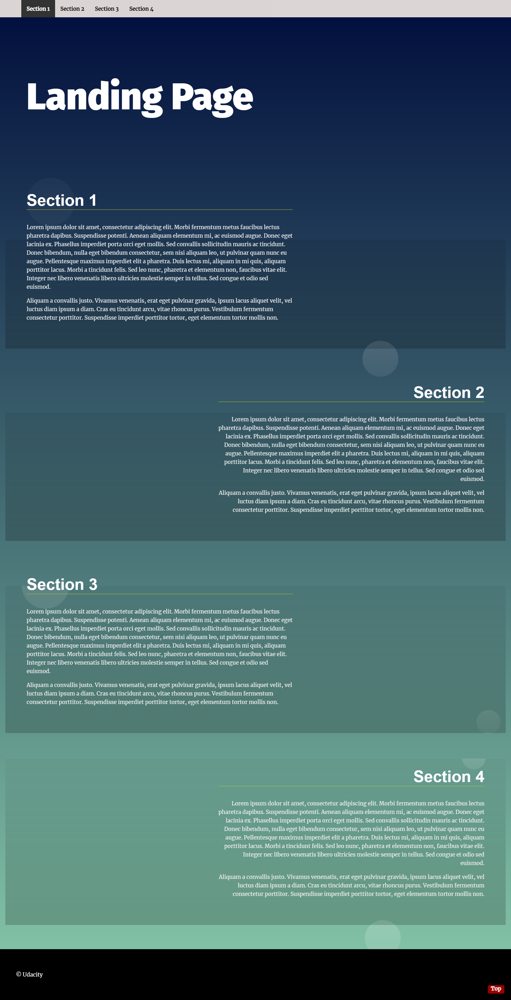

# Landing Page Project

- Multi-section landing page.that handle dymicaly new sections if it added
- responsive webpage made with HTML and CSS , flexbox and CSS Grid with some transitions in it
- Navigation is built dynamically as an unordered list. Start with empty ul and dynamically build navigation using Append , appendChild, and innerHTML.
- section will be viewed while scrolling through the page.
- When clicking an item from the navigation menu, the link should scroll to the appropriate section.

# Users should be able to:

- See hover states for interactive elements

### Screenshot

# you can try it from here:

- Live Site URL:(https://ibrahim11elian.github.io/landing-page/)

### Built with

- Semantic HTML5 markup
- CSS custom properties
- CSS Flexbox
- Javascript

## Author

- Facebook : (https://www.facebook.com/ibrahim11ahmed/)
- Linkedin : (https://www.linkedin.com/in/ibrahim-ahmed-a8bba9196/)
